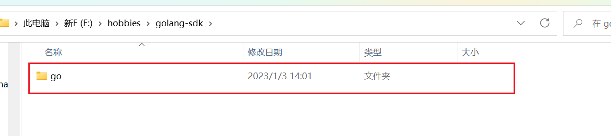
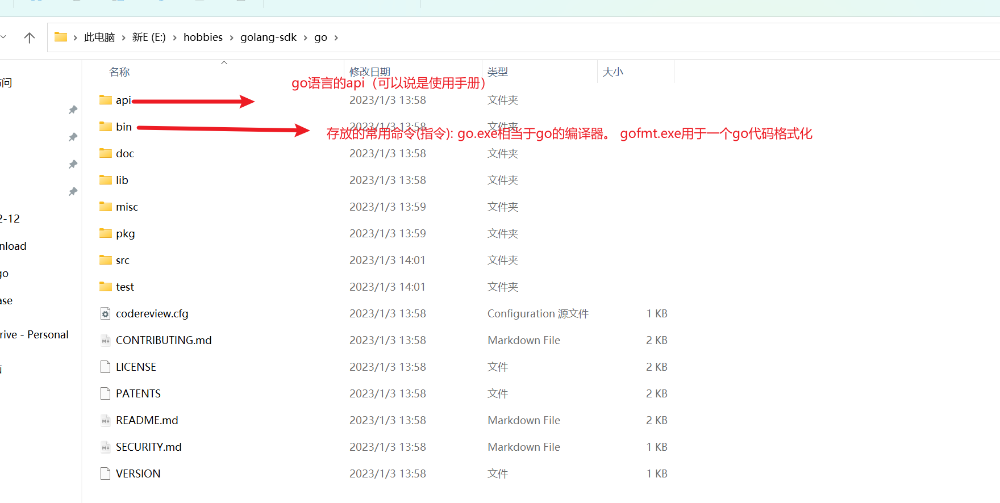
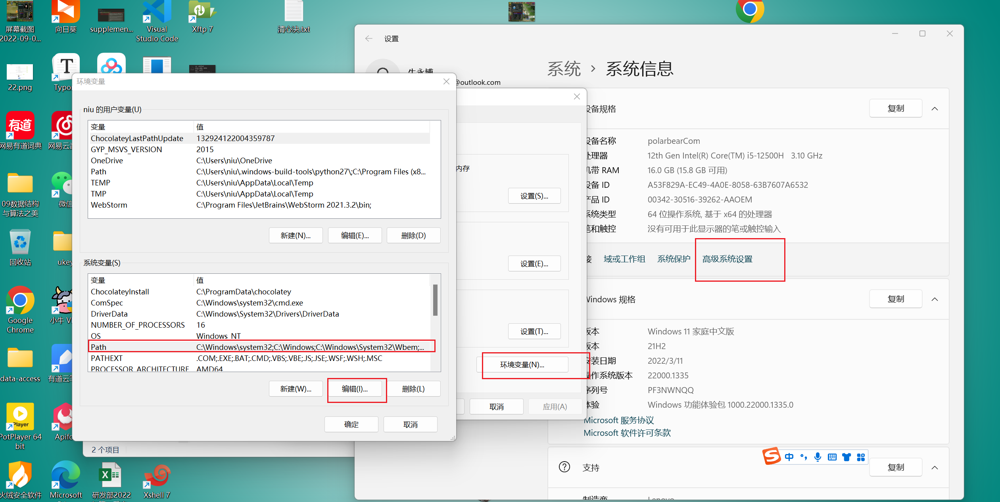

###  环境Go开发环境 - 安装和配置 `SDK`
#### 1. 基本介绍

	1. `SDK` 的全称（Software Development Kit   软件开发工具包）
	1. `SDK`是提供给开发人员使用的，其中包含了对应开发语言的工具包。

#### 2. SDK下载

	1. Go语言官网: golang.org (需翻墙)
	1. SDK下载地址: golang中文社区：https://studygolang.com/dl

#### 3. 安装SDK

 1. 下载msi镜像版本，如无特殊配置直接一直下一步就好。

 2. 下载压缩包，直接解压缩到想存放的目录即可使用。解压缩后如下图:

    

#### 4. SDK 目录文件夹介绍

#### 5. 将go.exe所在目录配置到环境变量Path中（想在任意目录下执行某个命令，则需要将此命令所在目录配置到环境变量Path中）

