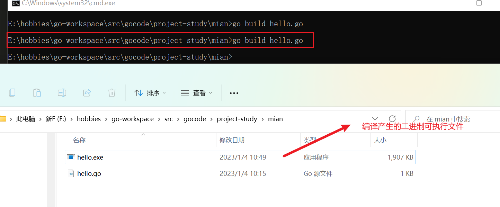
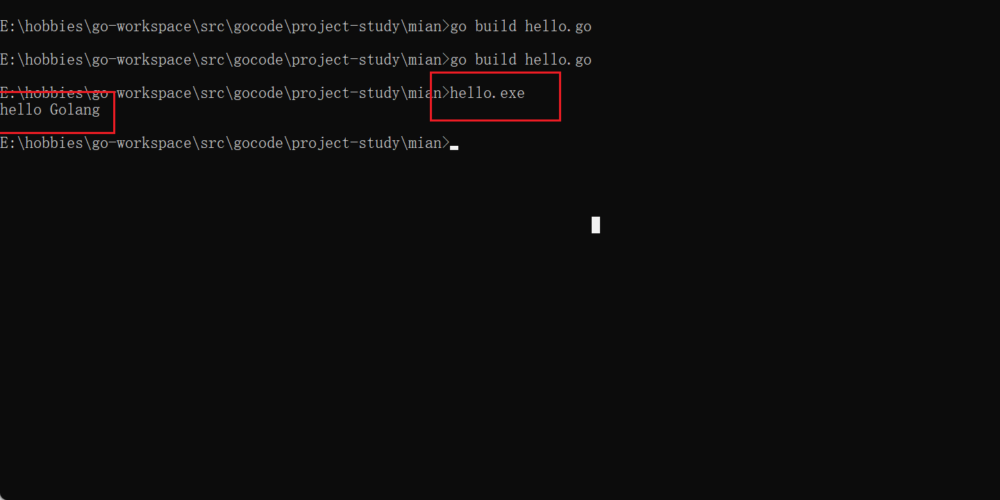
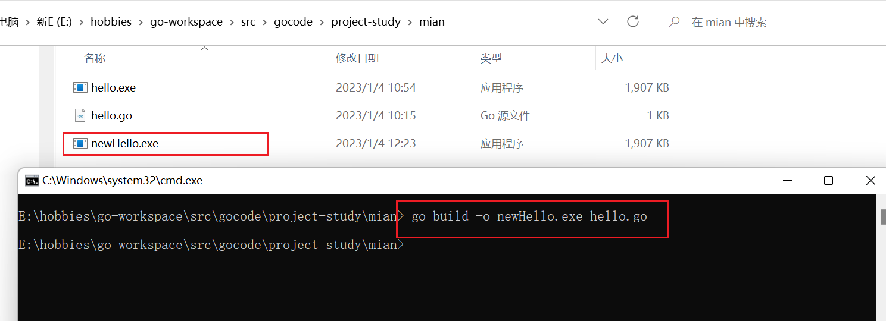

#### 第一段代码

1. 编写源代码

```go
// hello.go
package main // 声明文件所在的包， 每个go文件，必须有归属的包
import "fmt"	// 引入程序需要用到的包 fmt, 为了使用包下的函数

// 定义主函数 main，程序的入口
func main() {
	// 调用包下的函数 Println（打印函数）
	fmt.Println("hello Golang");
}
```

2. 对源文件进行编译: 进入源文件所在目录，然后执行  go build 文件名,成功后会生成  .exe(二进制可执行) 文件



3. 执行



4. 编译并执行: go run 源文件名   --- 直接编译并执行二进制文件，但不会生成 二进制文件（.exe）

5. 编译文件并指定编译后二进制文件的文件名: 如下图

   