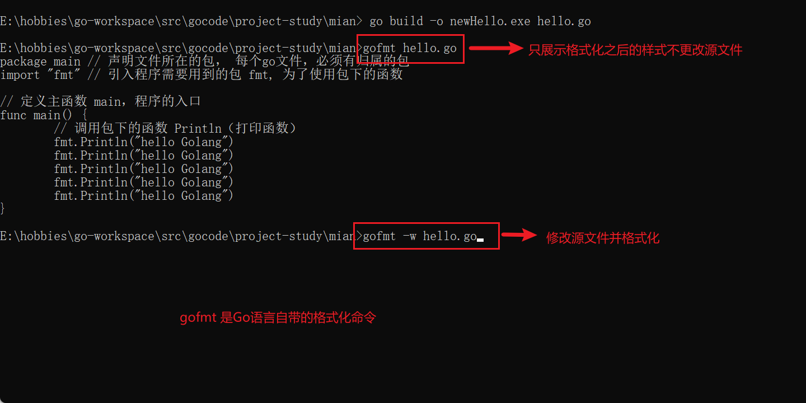

#### 代码风格

1. 注意缩进

   1. 向后缩进: tab键

   2. 向前缩进: shift + tab 键

   3. 通过命令格式化: 如下图

      

2. 成对编程: 即所有用到的 {} 、（）、' '、" "之类的符号都需成对。
3. 运算符两边加空白。
4. 注释推荐行注释
5. 行长约定: 一行最长不超过80个字符，超过的请使用换行展示，尽量保持格式优雅