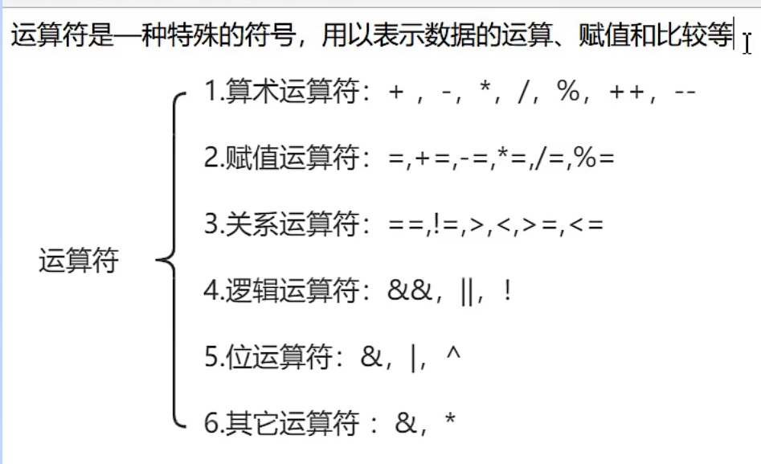

#### 算术运算符



注: 如果与js相同的就不再记录了

```go
package main  // 声明为main包， 程序的入口包
import (
	"fmt"
)

// main()函数，程序的入口函数
func main() {
	// 两个int类型相除，结果也为int类型
	fmt.Println("10 除以 3结果为:", 10 / 3)

	// 浮点类型参与运算，结果也为浮点型
	fmt.Println("10.0 除以 3结果为:", 10.0 / 3)
	fmt.Println("10 除以 3.0结果为:", 10 / 3.0)

	// ++/-- 自增/自减运算符
	// go语言中，++和--操作非常简单，只能单独使用，不能参与到运算中
	// 且在go中，++和--只能写在变量后面

} 
```


#### 关系运算符

关系运算符的结果都是 bool 型，也就是要么是true，要么是 false、

1. ==
2. !=
3. `>`
4. `<`
5. `>=`
6. `<=`

#### 逻辑运算符

1. && ： 逻辑与/短路与
2.  || : 逻辑或/短路或
3.  ! : 逻辑非

注: 因为go是静态类型语言，且不会发生隐式类型转换，所有逻辑运算符两边只能是 true（或者关系运算结果为true）或false（或者关系运算结果为false）