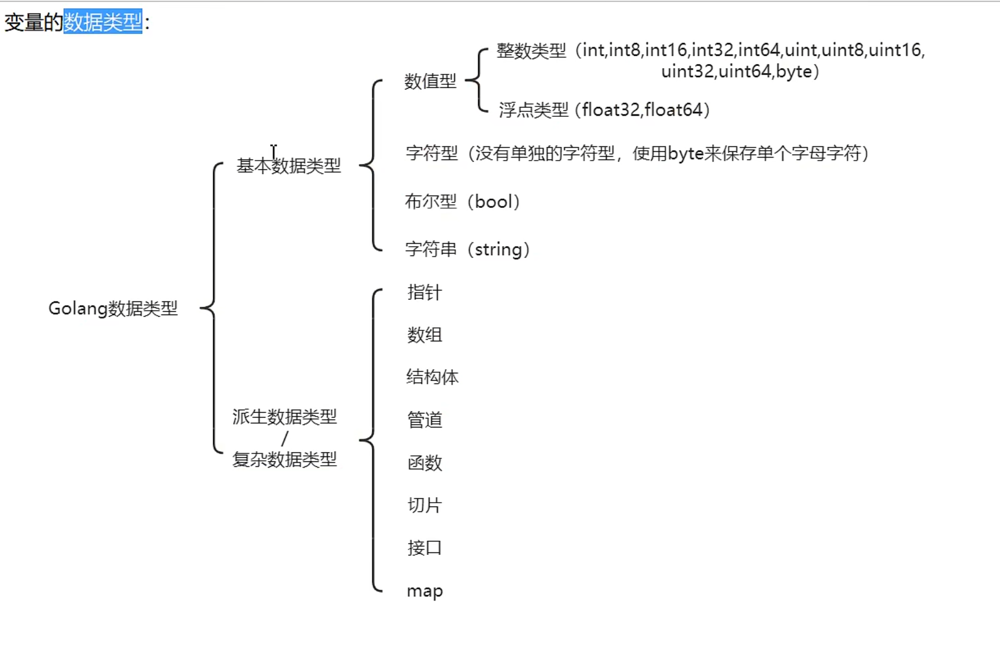

#### 变量

1. 简介:跟js一样，变量相当于内存中一个`数据存储空间`的表示。(就将它理解为js里的变量即可。)

2. 使用步骤:

   ```go
   package main // 声明文件所在的包， 每个go文件，必须有归属的包
   import "fmt"	// 引入程序需要用到的包 fmt, 为了使用包下的函数
   
   // 定义主函数 main，程序的入口
   func main() {
   	// 变量声明(可在声明的同时赋值)
    	// 变量名不能重复   
   	var age int = 18;
   	// 变量赋值
   	// age = 18;
   	// 变量使用
   	fmt.Println("age = ", age);
   }
   ```

   

3. 变量的四种使用形式：

   ```go
   package main // 声明文件所在的包， 每个go文件，必须有归属的包
   import "fmt"	// 引入程序需要用到的包 fmt, 为了使用包下的函数
   
   // 定义主函数 main，程序的入口
   func main() {
   	// 第一种: 指定变量的类型，并且赋值
   	var age int = 18;
   	fmt.Println(age);
   
   	// 第二种: 指定变量的类型，但不赋值，使用该类型的默认值
   	var num int;
   	fmt.Println("int 类型默认值为：", num);
   
   	// 第三种: 不指定变量的类型，那么程序会根据所赋的值自动类型推断
   	var str = "自动推断";
   	fmt.Println(str);
   
   	// 第四种: 省略 var 关键字 并且不指定变量类型，使用  := 对变量进行声明
      	// 试过此方法不能进行类型声明 
    	// 经尝试，此方法不能声明全局变量   
   	ignore := "省略var";
   	fmt.Println(ignore);
   }
   ```

4. 同时声明多个变量(此处与js语法不同)

      ```go
      package main // 声明文件所在的包， 每个go文件，必须有归属的包
      import "fmt"	// 引入程序需要用到的包 fmt, 为了使用包下的函数
      
      // 定义主函数 main，程序的入口
      func main() {
      	// 正常声明多个变量(只能声明同类型)
      	var n1, n2, n3 int;
      
      	fmt.Println(n1, n2, n3)
      
      	// 由自动类型推断同时声明多个变量(可声明不同类型变量)
      	var num, str, float = 1, "string", 1.08;
      	fmt.Println(num, str, float);
      
      	// 使用 := 声明变量(也可同时声明多个不同类型的变量)
      	i, f, s := 2, 8.8, "string";
      	fmt.Println(i, f, s) 
      }
      ```


5. 全局变量与局部变量 （基本与js相同，但声明全局变量时除了正常声明外，go提供了一种一次性声明的方式）

   

   ```go
   // 一次性声明全局变量
   // 经试验,全部变量的声明不能使用  :=
   package main // 声明文件所在的包， 每个go文件，必须有归属的包
   import "fmt"	// 引入程序需要用到的包 fmt, 为了使用包下的函数
   
   var (
   	m int = 1;
   	n string;  // 由此可见string类型的默认值为空字符串
   	str = "string";
   )
   
   // a := 18;
   
   // 定义主函数 main，程序的入口
   func main() {
   
   	fmt.Println("int m is ", m);
   	fmt.Println("string default value is ", n);
   	fmt.Println("str is", str); 
   	
   	// fmt.Println(a)
   }
   ```

   

   数据类型图:

   

   
   
   


   