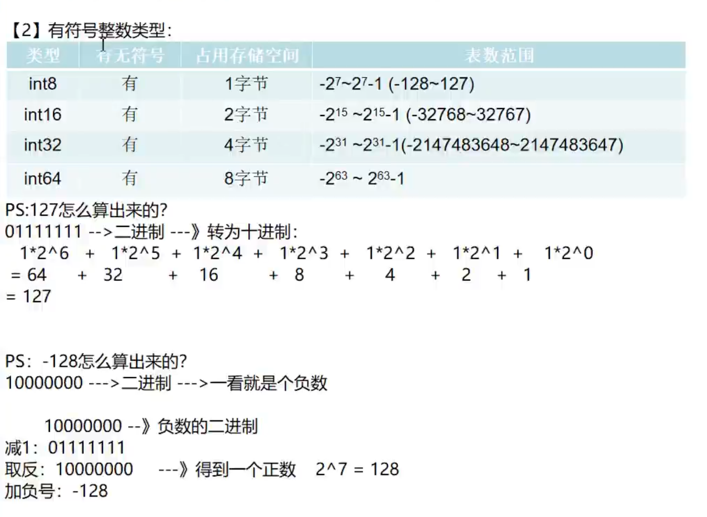

#### 整数类型

注：

1. 有符号整数类型的第一位0或1表示符号, 0表示正整数，1表示负整数。

2. 不同的整数类型有它各自的数值范围，定义变量时如果指定了类型，而赋值超出了数值范围，则会报错。

3. 数值的自动类型推断的类型为  int 

   ```go
   package main // 声明文件所在的包， 每个go文件，必须有归属的包
   import "fmt"	// 引入程序需要用到的包 fmt, 为了使用包下的函数
   
   
   // 定义主函数 main，程序的入口
   func main() {
   	var a = 28;
   
   	// Printf函数的作用就是：格式化的把 a 的类型填充到 %T 的位置上
   	fmt.Printf("数值的默认类型为: %T", a)  // 数值的默认类型为: int
   }
   ```

4. 在go程序中整形变量在使用时，遵守保小不保大的原则。即在保证程序正确运行下，尽量使用占用空间小的数据类型。


##### 有符号整数类型: 



##### 无符号整数类型:


无符号整数类型 uint32与uint64表数范围不对，该为 0~2^32 -1与0~ 2^64 -1.  

##### 其他整数类型


