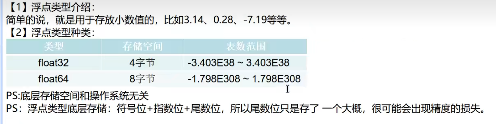

#### 浮点类型

1. 浮点类型基本介绍：(浮点类型默认值也为0)

   

2. 浮点数定义与科学计数法

```go
package main // 声明文件所在的包， 每个go文件，必须有归属的包
import "fmt"	// 引入程序需要用到的包 fmt, 为了使用包下的函数


// 定义主函数 main，程序的入口
func main() {
	var a float32 = 3.14;
	// 使用科学计数法表示小数  e 表示以10为底数的指数
	var b float64 = 314e-2;
	// 科学计数法 E 不区分大小写 
	var c  = 314E2;

	fmt.Println(a, b, c)

	// Printf函数的作用就是：格式化的把 a 的类型填充到 %T 的位置上
	fmt.Printf("数值的默认类型为: %T", c)  // 浮点数的默认类型为: float64
}
```


3. 精度丢失问题

```go
package main // 声明文件所在的包， 每个go文件，必须有归属的包
import "fmt"	// 引入程序需要用到的包 fmt, 为了使用包下的函数


// 定义主函数 main，程序的入口
func main() {
	var a float32 = 235.00001;
	
	var b float32 = 235.000000001;

	var c float64 = 235.000000001;
	// 浮点数存在精度丢失问题，所以在通常情况下，建议使用 float64
	fmt.Println(a); // 235.00002
	fmt.Println(b); // 235
	fmt.Println(c); // 235.000000001
}
```

