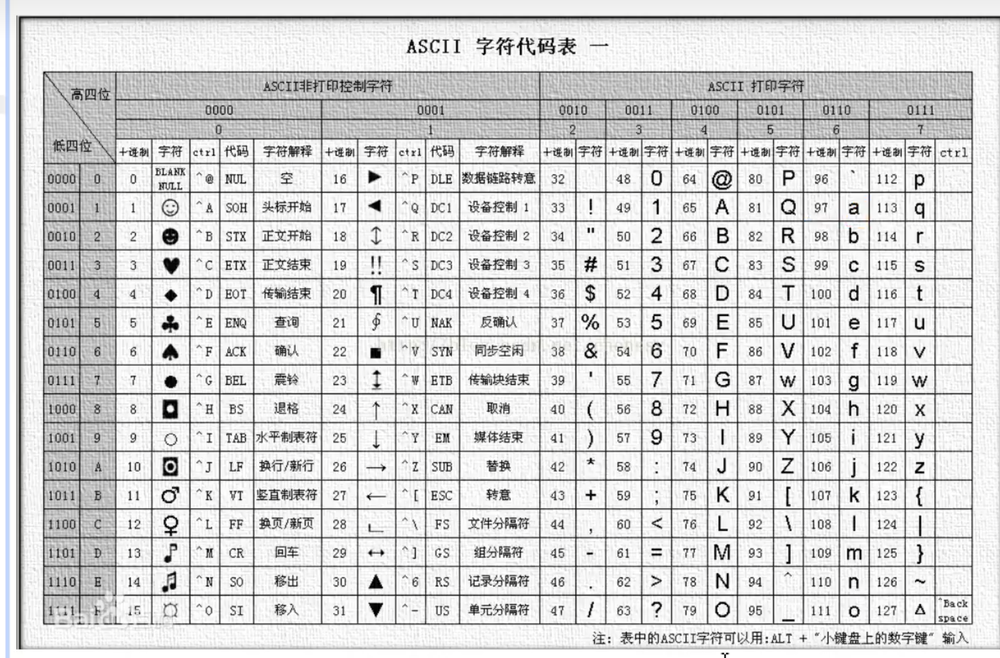
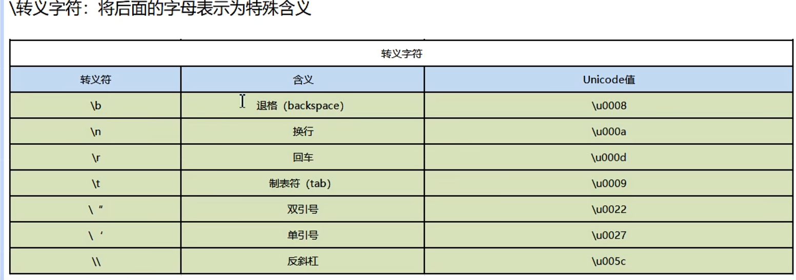

#### 字符类型

1. go中没有专门的字符类型，如果要存储单个字符(字母)，一般使用byte来保存。
2. go中的字符使用UTF-8编码。
3. 由单引号('')包裹，且只能有一个字符。


##### 定义字符及字符在底层的存储

```go
package main // 声明文件所在的包， 每个go文件，必须有归属的包
import "fmt"	// 引入程序需要用到的包 fmt, 为了使用包下的函数


// 定义主函数 main，程序的入口
func main() {
	// 定义字符类型的变量

	var a byte = 'a';
	fmt.Println(a) // 97

	var b byte = '6';
	fmt.Println(b) // 54

	var c byte = '(';
	fmt.Println(c + 20) // 60， 字符类型可以直接参与运算

	// 字符类型，本质上就是一个整数，也可以直接参与运算，输出字符的时候，会将对应的码值做一个输出
	// 字母，数字，标点等字符，底层都是安装ASCII码进行存储的。

	// 当所要表示的字符超出byte的取值范围(0~255)时，也可以使用整形表示
	var h uint16 = '中';
	fmt.Println(h) // 20013
	// 汉字字符，底层对应的是Unicode码值
	// 总结：go 的字符对应的使用的是UTF-8编码（Unicode是对应的字符集，UTF-8是Unicode的其中的一种编码方案）

	var g byte = 'A';
	fmt.Printf("g 对应的具体字符为: %c", g)

}
```


##### ASCII 表




##### 转义字符

