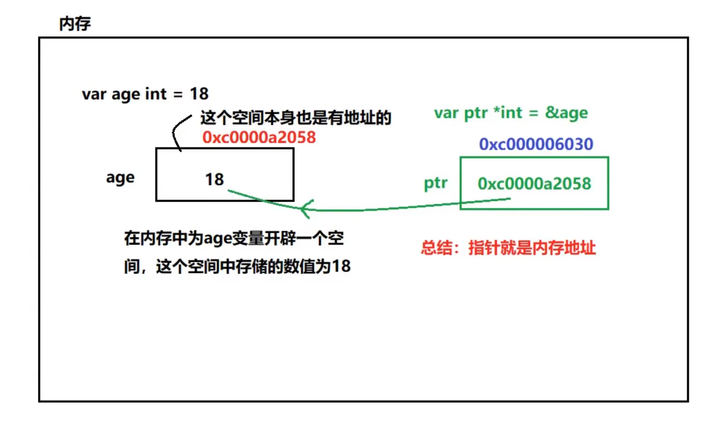

### 指针

1. 定义及使用

```go
package main
import (
	"fmt"
)

func main() {
	var age uint8 = 18

	// & 符号后跟变量，即可获取此变量的内存地址
	fmt.Println("age 的内存地址为：", &age)

	// 定义一个指针变量
	// ptr 指针变量的名字
	// ptr 对应的类型是：*uint8  是一个指针类型(可以理解为指向int类型的指针)
	// ptr 对应的指针类型要与指向变量的类型一致
	// &age 即ptr变量存储的具体的值
	var ptr *uint8 = &age
	fmt.Println(ptr) // 存储变量age的内存地址
	fmt.Println("这个指针变量ptr 本身的内存地址为:", &ptr)

	// 想获取ptr这个指针或者说这个地址指向的那个数据,使用 *号加指针变量名
	fmt.Println("ptr 这个指针指向的值为", *ptr)

}
```

2. 基本数据类型及指针内存分析

    

    ###### 总结: 最重要的是两个符号

    1. &:  &取变量内存地址
    2. *:  *根据内存地址取值

##### 指针的使用

1. 可以通过指针改变`指向值`，即可以改变指针所指的变量的值。

```go
package main
import (
	"fmt"
)

func main() {
	var age uint8 = 18

	// 定义age的指针 ptr
	var ptr *uint8 = &age

	// 通过 *ptr获取指针的指向值，然后改变
	*ptr = 20

	// 经过 *ptr改变指针指向后的值
	fmt.Println("通过指针改变后的age值为: ", age) // 20
}
```

2. 指针变量接收的一定是地址值
3. 指针变量的地址类型和变量类型不可以不匹配。即int要对应 *int， uint8 要对应 *uint8 依次类推。
4. 基本数据类型（又叫值类型），都有对应的指针类型，形为  *数据类型。即原有数据类型前加个 *。