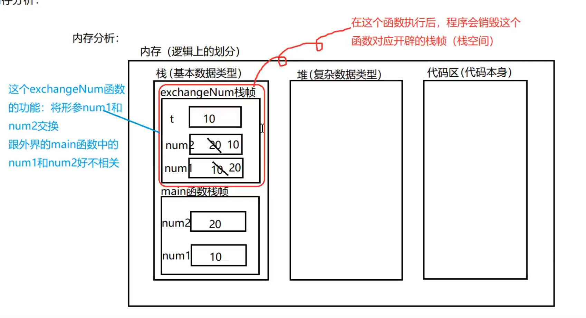

#### 函数的内存分析

注: 基本与 js 相同，参考下图及代码块

```go
package main  
import (
	"fmt"
)

func main() {
	var num1 int = 10
	var num2 int = 20

	fmt.Printf("交换前， num1 的值为: %d, num2 的值为： %d \n", num1, num2)

	exchangeNum(num1, num2)
	fmt.Printf("交换后， num1 的值为: %d, num2 的值为： %d", num1, num2)
	
} 

// 交换num1 与 num2 的值
func exchangeNum(num1 int, num2 int) {
	var t int
	t = num1
	num1 = num2
	num2 = t
	fmt.Println("在 exchangeNum函数中 num1 与 num2 已完成交换")
}
```

