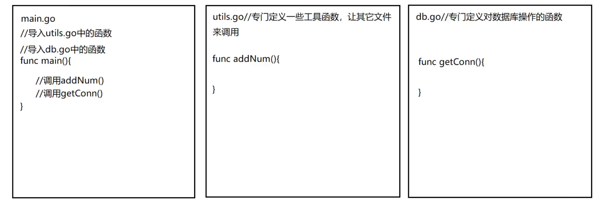

#### 包

1. 使用包的原因

    1. 程序中不可能把所有的函数放在同一个源文件中，需要分门别类的把函数放在不同的源文件中。

    2. 解决同名问题：在同一文件中不能起同名函数，但在不同的包中可以。

        

2. 注意事项
    1. 在同一个目录下，只能有一个包（但可以有多个go文件），在一个包下，不能重复声明（即使是同一个包下，不同文件也不行）
    2. 一个目录下的同级文件，归属于一个包
3. 包是什么?
    1. 在程序层面，所有使用相同 package 包名 的源文件组成的代码模块
    2. 在源文件层面就是一个文件夹
4. 包的别名: 在go中可以对导入的包声明一个别名，只需要在导入的包前加一个标识符即可。（不用像js还需要as）
    1. 语法：别名   导入的包