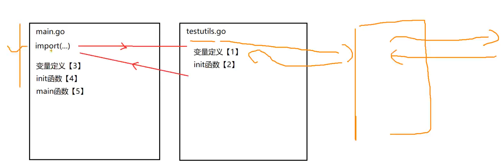

#### init函数

1. 简介：初始化函数，可以用来进行一些初始化操作

2. 执行时间：每一个源文件都可以包含一个init函数，该函数会在main函数执行前，被go运行框架调用。

    1. 全局变量定义，init函数，main函数的执行流程

        ```go
        package main
        
        import (
        	"fmt"
        )
        
        // main函数是程序入口文件，在全局变量声明之后和init函数执行之后执行
        func main() {
        	fmt.Println("package main's main is running", variable)
        }
        
        // 然后init函数会在main函数之前执行
        func init() {
        	fmt.Println("package main's init() is running ")
        }
        
        // 变量声明会被首先执行
        var variable int = assign()
        
        func assign() int {
        	fmt.Println("assign variable is running")
        	return 10
        }
        
        ```

3. 多个源文件都有init函数的时候，执行顺序:

    