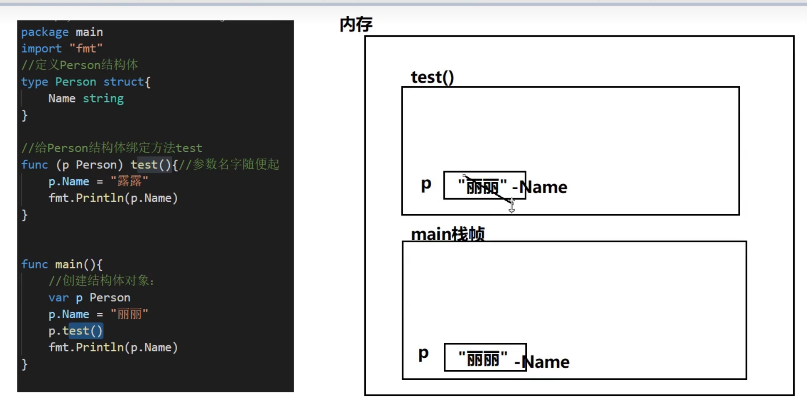
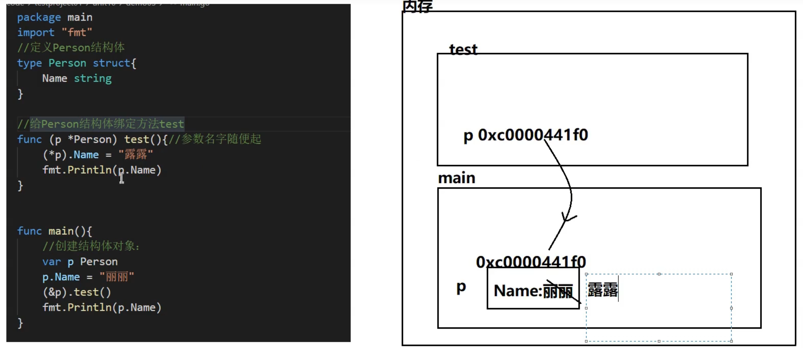

#### 方法

1. 方法是作用在指定的数据类型上、和指定的数据类型绑定，因此自定义类型，都可以有方法，而不仅仅是struct
2. 方法的声明与调用格式

```go
package main

import "fmt"

// 定义结构体Stu
type Stu struct {
	Age uint8
}

// 定义结构体方法read
// 其中(s Stu)中， s代表调用此方法的结构体实例的值，此传递是值传递。
// Stu表示read方法绑定结构体类型Stu
func (s Stu) read() {
	fmt.Println("read book")
	s.Age = 36
	fmt.Println("read 方法修改Age后为", s.Age)
}

func main() {
	// 定义结构体s并赋初值
	var s Stu = Stu{18}
	// 调用read方法
	s.read()
	fmt.Println("原s结构体值为", s.Age)
}

```

注：结构体方法中传递的结构体对象（上述代码里的s）是值传递，和函数参数传递一致。



3. 通过指针来实现接受者参数引用传递

```go
package main

import "fmt"

// 定义结构体Stu
type Stu struct {
	Age uint8
}

// 定义结构体方法read
// 通过指针来传递变量的地址，从而实现引用传递
func (s *Stu) read() {
	fmt.Println("read方法调用前age为", s.Age)
	s.Age = 36
	fmt.Println("read 方法修改Age后为", s.Age)
}

func main() {
	// 定义结构体s并赋初值
	var s Stu = Stu{18}
	// 调用read方法
	s.read()
	fmt.Println("原s结构体值为", s.Age)
}

```

// 内存分析



4. 如果一个类型实现了String()这个方法，那么fmt.Println()默认会调用这个变量的String()进行输出。(功能相当于js中的toString方法)

```go
package main

import "fmt"

type Person struct {
	name string
}

// 为Person结构体定义String方法
func (p Person) String() string {
	// fmt.Sprintf返回字符串
	str := fmt.Sprintf("name = %v", p.name)
	return str
}
func main() {
	// 定义my并初始化赋值
	var my Person = Person{"jj"}
	fmt.Println(my)
	fmt.Println(&my)
}

```

