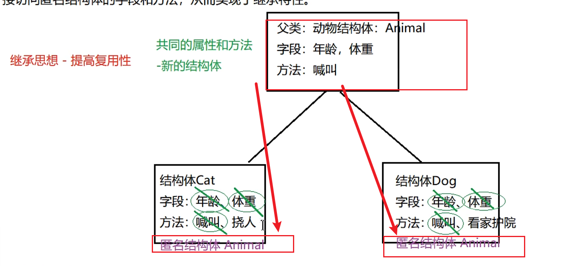

#### 继承

1. go中的继承：当多个结构体存在相同的属性和方法时，可以从这些结构体中抽象出结构体，在该结构体中定义这些相同的属性和方法，其他的结构体不需要重新定义这些属性和方法，只需嵌套一个匿名结构体即可。即如果一个结构体嵌套了另一个匿名结构体，那么这个结构体可以直接访问匿名结构体的属性和方法，从而实现继承。



2. 代码实现

```go
package main

import (
	"fmt"
)

// 定义结构体Person
type Person struct {
	Name string
	Age  uint8
}

func (p Person) Run() {
	fmt.Println("running")
}

// 定义结构体Stu
type Stu struct {
	// 使用匿名结构体继承Person属性
	Person
	school string
}

func (s *Stu) Read() {
	fmt.Println("read book")
}
func main() {
	// 不初始化赋值
	// s := Stu{}

	// 如果要初始化赋值的话，这种形式需要也对继承的类初始化赋值
	// 或者使用 Stu {school: "htu",} 的形式单独赋值
	s := Stu{Person{"jj", 19}, "htu"}
	fmt.Println(s)
	s.Read()
	// 访问调用继承类的属性和方法可以不需要通过Person属性
	s.Person.Run()
	// 不通过Person属性访问
	s.Run()
}

```

3. 跟js一样，如果本身有这个属性，那么优先使用本身的值，如果要访问继承的值，可以通过被继承的属性名访问。形如s.Person.Run()。
