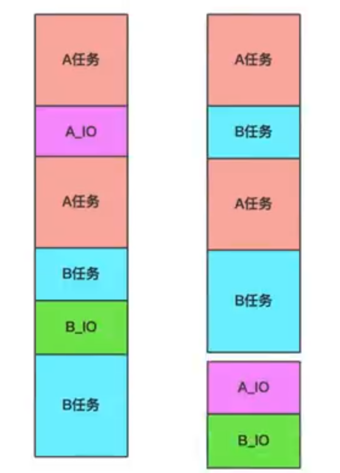

#### 协程

1. 简介：协程又称微线程，纤程，协程是一种用户态的轻量级线程。（go语言的多线程一般都是用协程实现的）
2. 作用：在执行A函数的时候，可以随时中断，去执行B函数，然后中断继续执行A函数（可以自动切换），注意这一切换过程并不是函数调用（没有调用语句），过程很像多线程，然后协程中只有一个线程在执行（协程的本质是单线程）



注：上图中A_IO与B_IO的执行是读取磁盘的过程，不消化cpu内存。


3. 协程执行的详细解释：对于单线程下，我们不可避免程序中出现io操作，但如果我们能在自己的程序中（即用户程序级别，而非操作系统级别）控制单线程下的多个任务能在一个任务遇到io阻塞时就将寄存器上下文和栈保存到某个其他地方，然后切换到另一个任务去计算。在任务切回来的时候，恢复先前保存的寄存器上下文和栈，这样就保证了该线程能够最大限度地处于就绪态，即随时都可以被cpu执行的状态，相当于我们在用户程序级别将自己的io操作最大限度地隐藏起来，从而可以迷惑操作系统，让其看到：该线程好像是一直在计算，io比较少，从而会更多的将cpu的执行权限分配给我们的线程（注意：线程是cpu控制的，而协程是程序自身控制的，属于程序级别的切换，操作系统完全感知不到，因而更加轻量级）


4. 代码实现

```go
package main

import (
	"fmt"
	"time"
)

func PrintJJ() {
	for i := 0; i < 10; i++ {
		fmt.Printf("hello golang %d \n", i)
		// 阻塞程序运行1秒
		// time.Second 是秒的意思
		time.Sleep(time.Second * 1)
	}
}

func main() { // 主线程

	// go中开启协程只需在要开启前加一个go关键字，就代表开启了一个协程
	go PrintJJ()

	for i := 0; i < 10; i++ {
		fmt.Println("hello jj")
		// 阻塞程序运行1秒
		// time.Second 是秒的意思
		time.Sleep(time.Second * 1)
	}

	// go中开启协程只需在要开启前加一个go关键字，就代表开启了一个协程
	// 但如果将代码放在这里，未执行此协程就会退出程序（主死从随）
	// go PrintJJ()

}

```

// 开启多个协程

```go
package main

import (
	"fmt"
	"time"
)

func main() { // 主线程

	for i := 0; i < 5; i++ {

		// 使用匿名函数创建协程
		// 外部变量 + 匿名函数 = 闭包，查看此效果只需使用外部变量i 而不适用传入的参数n
		go func(n int) {
			fmt.Println(n)
		}(i)
	}

	time.Sleep(time.Second * 2)

}

```

