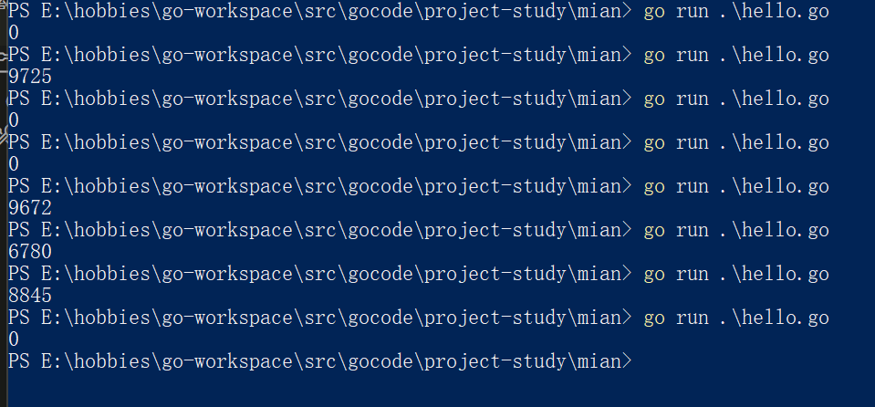
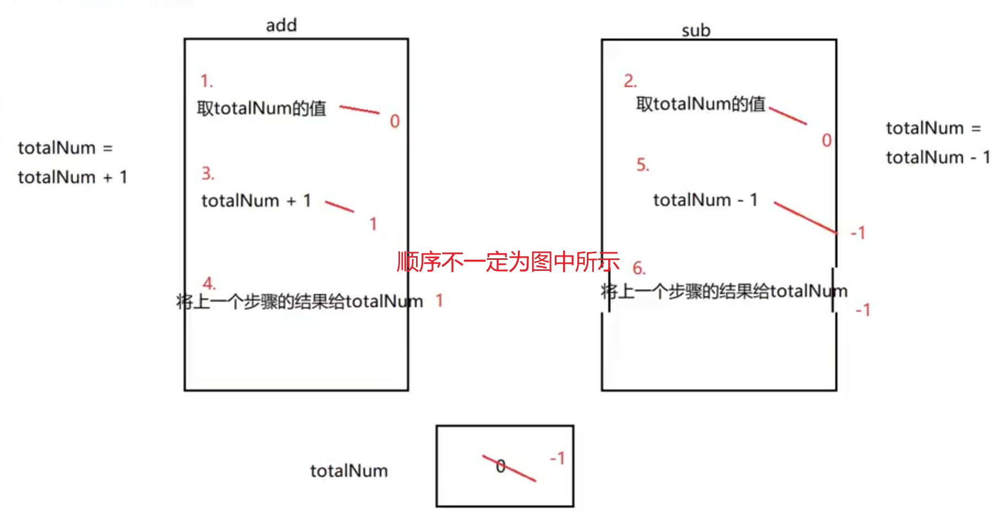

#### WaitGroup

1. 简介：WaitGroup用于等待一组线程的结束。父线程调用Add方法来设定应等待的线程的数量。每个被等待的线程在结束时应调用Done方法。同时。主线程里可以调用Wait方法阻塞至所有线程结束。---->解决主线程在子协程结束后自动结束。

```go
package main

import (
	"fmt"
	"sync" // 导入sync包
)

// 定义sync.WaitGroup类型的变量wg
var wg sync.WaitGroup

func main() { // 主线程
	for i := 0; i < 5; i++ {
		// 协程开始时WaitGroup计数器添加1
		wg.Add(1)

		go func(n int) {
            // 如果为了防止忘记wg.Done()，可以使用defer关键字
            defer wg.Done()
            fmt.Println(n)
			// 协程结束时调用Done方法减少计数器的值减1（正常方案）
			// wg.Done()
		}(i)
	}

	// 调用Wait方法阻塞直到WaitGroup计算器减为0
	wg.Wait()
}

```


2. 使用多个协程更改同一个变量

```go
package main

import (
	"fmt"
	"sync"
)

// 定义全局变量j
var j int

// 定义sync.WaitGroup类型变量 wg
var wg sync.WaitGroup

func add() {
    // defer关键字当函数执行完毕后再执行defer后的语句
	// 当次协程完成后调用Done方法
	defer wg.Done()
	for i := 0; i < 10000; i++ {
		j += 1
	}
}

func sub() {
	defer wg.Done()
	for i := 0; i < 10000; i++ {
		j -= 1
	}
}

// 主线程
func main() {
    // 协程计数器值加2
	wg.Add(2)
	// 开启协程
	go add()
	// 开启协程
	go sub()
	// 阻塞程序停止直到当协程计数器值为0时
	wg.Wait()

	fmt.Println(j)
}

```

// 上述代码执行结果



// 简单看上述代码执行完毕后结果应该一定为0，但实际却不是。

// 出现问题的原因如下（下图中的顺序并不一定是那样操作）--- （并发交替执行）




###### 解决上述问题：应该有一个机制 --- 确保一个协程在执行逻辑的时候另外的协程不执行 ------ 锁的机制 ---此处使用加入互斥锁mutex

```go
package main

import (
	"fmt"
	"sync"
)

// 定义全局变量j
var j int

// 定义sync.WaitGroup类型变量 wg
var wg sync.WaitGroup

// 定义互斥锁类型变量lock
var lock sync.Mutex

func add() {
	// 当次协程完成后调用Done方法
	defer wg.Done()
	for i := 0; i < 10000; i++ {
		// 执行逻辑操作前加锁
		lock.Lock()
		j += 1
		// 逻辑处理后解锁
		lock.Unlock()
	}
}

func sub() {
	defer wg.Done()
	for i := 0; i < 10000; i++ {
		// 逻辑处理前加锁
		lock.Lock()
		j -= 1
		// 逻辑处理后解锁
		lock.Unlock()
	}
}

// 主线程
func main() {
	wg.Add(2)
	go sub()

	go add()

	wg.Wait()

	fmt.Println(j)
}

```

