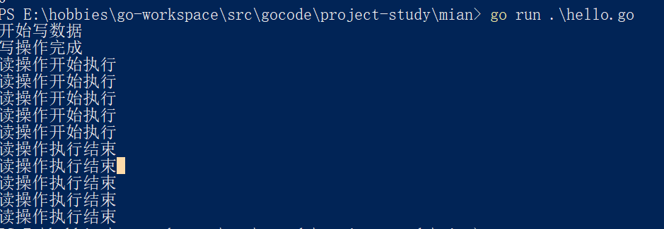

#### 读写锁RWMutex

golang中sync包实现了两种锁Mutex（互斥锁）和RWMutex（读写锁）

1. 互斥锁Mutex：Lock()加锁，Unlock()解锁，使用Lock方法加锁后，便不能再次对其进行加锁，直到利用Unlock方法进行解锁后，才能够再次加锁，适用于读写不确定的场景，即读写次数没有明显的区别。<strong>缺点就是性能、效率相对来说较低</strong>

2. 读写锁RWMutex：其经常用于读次数远远多余写次数的场景

    1. 因为在读的时候，数据之间不产生影响，写和读之间才会产生影响。

    ```go
    package main
    
    import (
    	"fmt"
    	"sync"
    	"time"
    )
    
    // 定义sync.WaitGroup类型变量 wg
    var wg sync.WaitGroup
    
    // 定义读写锁类型变量lock
    var lock sync.RWMutex
    
    // 定义读函数
    func Read() {
    	defer wg.Done()
    	// 如果只是读数据操作，那么这个锁不产生影响，但是读写同时发生时，就会有影响
    	lock.RLock()
    	fmt.Println("读操作开始执行")
    
    	// 使用time.sleep模拟读操作
    	time.Sleep(time.Second * 2)
    
    	fmt.Println("读操作执行结束")
    
    	// 解锁
    	lock.RUnlock()
    }
    
    // 写操作
    func Write() {
    	defer wg.Done()
    	// 调用锁
    	lock.Lock()
    
    	fmt.Println("开始写数据")
    
    	// 使用Sleep模拟写操作
    	time.Sleep(time.Second * 3)
    
    	fmt.Println("写操作完成")
    
    	lock.Unlock()
    }
    
    // 主线程
    func main() {
    	wg.Add(6)
    	for i := 0; i < 5; i++ {
    		go Read()
    	}
    
    	go Write()
    
    	wg.Wait()
    
    }
    
    ```

    执行效果如下：要运行一下代码看执行过程

    