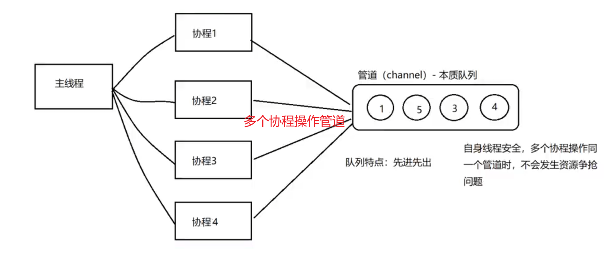

#### 管道（channel）

1. 特质介绍

    1. 管道本质就是一个数据结果-队列
    2. 数据是先进先出
    3. 自身线程安全，多协程访问时，不需要加锁，channel本身就是线程安全的。
    4. 管道是有类型的，一个string管道只能存放string类型数据

    

2. 管道定义： var  变量名  chan  数据类型

    1. chan 是 管道关键字
    2. 数据类型指的是管道的类型，里面放入数据的类型
    3. 管道是引用类型，必须初始化才能写入数据，即make后才能使用

    ```go
    package main
    
    import "fmt"
    
    func main() {
    	// 定义int类型的管道变量 intChan
    	var intChan chan int
    	// 使用make函数对管道进行初始化，并设置管道长度
    	intChan = make(chan int, 3)
    
    	// 证明管道是引用类型
    	fmt.Printf("intChan的值：%v \n", intChan) // 打印的是改变量所存的地址
    
    	// 向管道存放数据
    	intChan <- 10
    	num := 20
    	intChan <- num
    	fmt.Printf("intChan: %v \n", intChan)
    	fmt.Printf("管道的实际长度：%v, 管道的容量：%v \n", len(intChan), cap(intChan))
    	// 取出管道变量
    	// 注意：在没有协程的情况下，取出超出管道实际长度的值会出错
    	n1 := <-intChan
    	n2 := <-intChan
    
    	fmt.Println("n1:", n1)
    	fmt.Println("n2:", n2)
    	fmt.Printf("intChan: %v \n", intChan)
    	fmt.Printf("管道的实际长度：%v, 管道的容量：%v \n", len(intChan), cap(intChan))
    
    }
    
    ```

3. 管道的关闭：使用内置函数close可以关闭管道，当管道关闭后，就不能再向管道写数据了，但是仍然可以从该管道读取数据。

    ```go
    package main
    
    import "fmt"
    
    func main() {
    	// 定义int类型管道变量intChan
    	var intChan chan int = make(chan int, 3)
    
    	// 向管道存储数据
    	intChan <- 20
    	intChan <- 30
    	fmt.Printf("管道的实际长度：%v, 管道的容量：%v \n", len(intChan), cap(intChan))
    
    	// 使用close函数关闭管道
    	close(intChan)
    
    	// 再次写入数据： --- 放开以下放错
    	// intChan <- 90
    
    	// 当管道关闭后，读取数据是可以的
    	num := <-intChan
    
    	fmt.Println(num)
    
    }
    
    ```

4. 管道的遍历：管道支持for - range 的方式进行遍历，需注意两个细节：

    1. 在遍历时，如果管道没有关闭，则会出现deadlock的错误
    2. 在遍历时，如果管道已经关闭，则会正常遍历数据，遍历完后，就会退出遍历。

    ```go
    package main
    
    import "fmt"
    
    func main() {
    	// 定义int类型管道变量intChan
    	var intChan chan int = make(chan int, 67)
    
    	// for 循环写入元素
    	for i := 0; i < 67; i++ {
    		intChan <- i
    	}
    
    	// 关闭管道，否则报错fatal error: all goroutines are asleep - deadlock!
    	close(intChan)
    
    	// for range 循环读取元素
    	// range over intChan (variable of type chan int) permits only one iteration
    	for v := range intChan {
    		fmt.Println("值为：", v)
    	}
    
    }
    
    ```

5. 声明只读只写管道

    1. 默认情况下，管道都是双向的   ---  可读可写
    2. 声明为只写变量  var 变量名 chan<- int  // 管道具备<- 只写性质
    3. 声明为只读变量  var 变量名 <-chan  int  // 管道具备<- 只读性质 