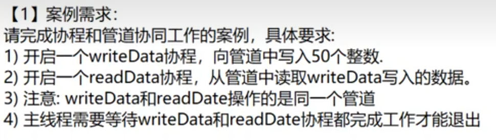
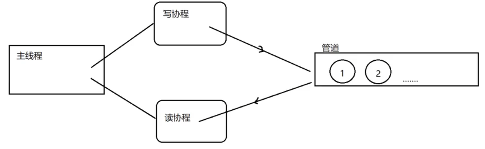

#### 协程和管道协同工作

1. 问题：



// 未看解析自写

```go
package main

import (
	"fmt"
	"sync"
)

// 定义等待组变量wg
var wg sync.WaitGroup

// 定义int类型管道变量intChan
var intChan chan int = make(chan int, 33)

// writeData协程
func WriteData() {
	// 此协程执行结束后等待组减1
	defer wg.Done()
	// for循环向管道写入数据
	for i := 0; i < 33; i++ {
		intChan <- i
		fmt.Println("写数据为", i)
	}

	// 写入完毕后关闭管道，待读取通道使用
	close(intChan)

}

// readData协程
func ReadData() {
	// 此协程执行结束后等待组减1
	defer wg.Done()
	// for range 循环读取数据
	for v := range intChan {
		fmt.Println("读数据为：", v)
	}
}

func main() {
	// 定义等待组数量为2
	wg.Add(2)

	// 开启写数据协程
	go WriteData()
	// 开启写数据协程
	go ReadData()
	// 待等待组为0时再关闭协程
	wg.Wait()
}

```



// 视频解析 -- 基本流程相似，此处将管道定义到了main函数内部，且加了一个time.sleep()做延迟

```go
package main

import (
	"fmt"
	"sync"
	"time"
)

// 定义等待组变量wg
var wg sync.WaitGroup

// writeData协程
func WriteData(intChan chan int) {
	// 此协程执行结束后等待组减1
	defer wg.Done()
	// for循环向管道写入数据
	for i := 0; i < 33; i++ {
		intChan <- i
		fmt.Println("写数据为", i)
		time.Sleep(time.Second)
	}

	// 写入完毕后关闭管道，待读取通道使用
	close(intChan)

}

// readData协程
func ReadData(intChan chan int) {
	// 此协程执行结束后等待组减1
	defer wg.Done()
	// for range 循环读取数据
	for v := range intChan {
		fmt.Println("读数据为：", v)
		time.Sleep(time.Second)
	}
}

func main() {
	// 定义int类型管道变量intChan
	var intChan chan int = make(chan int, 33)
	// 定义等待组数量为2
	wg.Add(2)

	// 开启写数据协程
	go WriteData(intChan)
	// 开启写数据协程
	go ReadData(intChan)
	// 待等待组为0时再关闭协程
	wg.Wait()
}

```


