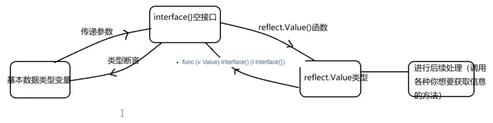

#### reflect（反射）--- 需引入包 "reflect"

1. 反射的作用：
    1. 反射可以在运行时动态获取变量的各种信息，比如变量的类型 ，类别等信息。
    2. 如果是结构体变量，还可以获取到结构体本身的信息（包括结构体的字段，方法）
    3. 通过反射，可以修改变量的值，可以调用关联的方法
2. 反射相关的函数
    1. reflect.TypeOf(变量名)：获取变量的类型，返回reflect.Type类型
    2. reflect.ValueOf(变量名)：获取变量的值，返回reflect.Value类型（reflect.Value是一个结构体类型），通过reflect.Value，可以获取到关于该变量的很多信息。
3. 基本数据类型与reflect.Value类型转化过程



```go
package main

import (
	"fmt"
	"reflect"
)

func main() {
	// 定义int变量val
	val := 100

	// 因为reflect.ValueOf与TypeOf接收的是接口类型的值，空接口可以是任何类型的值

	// 调用reflect.TypeOf()函数，返回reflect.Type类型数据
	resType := reflect.TypeOf(val)

	fmt.Println("resType：", resType)

	fmt.Printf("resType 具体的类型是：%T \n", resType)

	// 调用reflect.Value()函数，返回reflect.ValueOf数据类型
	resValue := reflect.ValueOf(val)
	// 这里之所以展示还是100，应该是在此类型内部实现了ValueOf方法，所以打印才显示值
	fmt.Println("resValue：", resValue)
	fmt.Printf("resValue 具体的类型是：%T", resValue)
}

```

