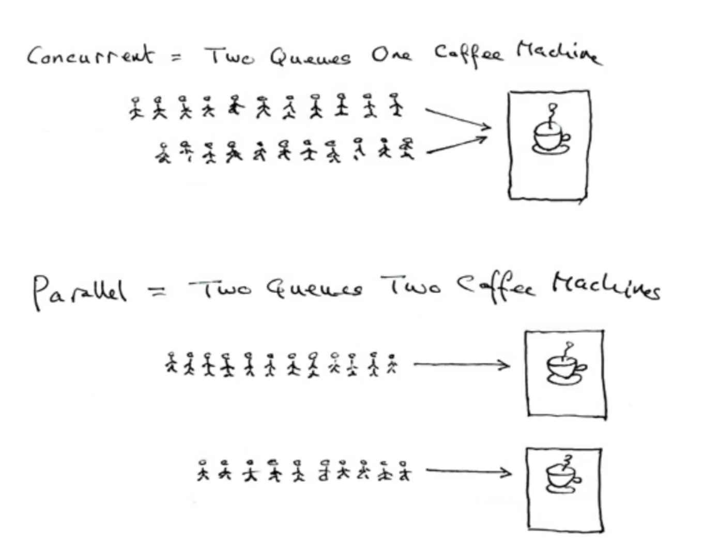

#### 并发编程

1. 基本概念：（以前有进程与线程的概念）
    1. 进程（Process）：进程是并发执行的程序中分配和管理资源的基本单位。
    2. 线程（Thread）：线程是进程的执行单元，是进行调度的实体，是比进程更小的独立运行单位。
    3. 并行（Concurrent）：多个线程同时操作多个资源类
    4. 并发（Paralled）：多线程交替操作同一个资源类

