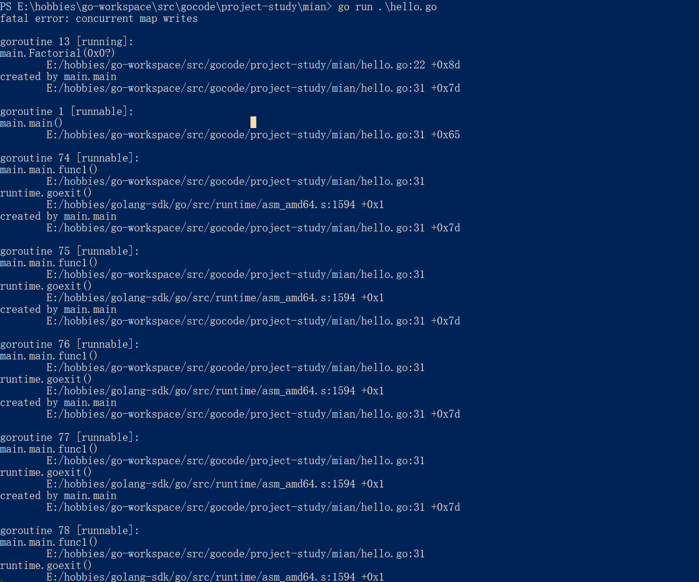
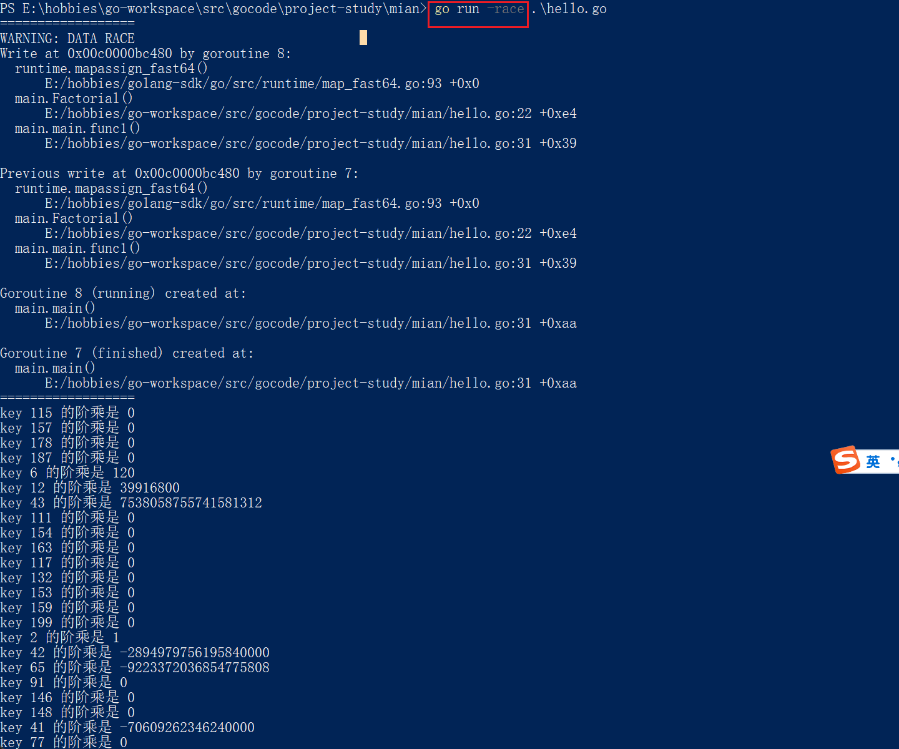

#### 协程goroutine（这里偏进阶应用）

1. 协程基本概念：轻量级的线程，独立的栈空间，共享程序堆空间，调度由用户控制，是逻辑态，对资源消耗小。（基本概念的高度概括）--- 自带CPU的上下文
2. 线程和协程的区别：线程的切换是一个cpu在不同线程中来回切换，是从系统层面来的，不止保存和恢复cpu上下文这么简单，会非常耗费性能。但是协程只是在同一个线程内来回切换不同的函数，只是简单的操作cpu的上下文，所以耗费的性能大大减少。
3. golang的协程机制，可以轻松开启上万个协程。其他语言并发机制一般基于线程，开启过多资源耗费大。


##### 并发安全问题

1. 当多个协程处理处理一个不安全的数据类型时，会出现数据竞争的错误

```go
package main

import (
	"fmt"
	"sync"
	"time"
)

var (
	wg      sync.WaitGroup          // 定义协程等待组类型变量wg
	testMap = make(map[int]int, 10) // 定义map[int]int 类型的map变量testMap
)

// 计算一个数的阶乘，并存储道testMap中
func Factorial(n int) {
	defer wg.Done()
	res := 1
	for i := 1; i < n; i++ {
		res *= i
	}

	testMap[n] = res
}

func main() {
	// 记录开始时间start
	start := time.Now()
	wg.Add(200)
	// 循环开启协程，计算1-200的阶乘
	for i := 1; i <= 200; i++ {
		go Factorial(i)
	}
	wg.Wait()

	// 遍历testMap
	for key, val := range testMap {
		fmt.Printf("key %d 的阶乘是 %d \n", key, val)
	}

	end := time.Since(start)
	fmt.Println(end)
}

```

// 直接运行上面代码会出现以下报错：(go run 执行)



// go run -race 执行



##### 问题的原因：多协程   并发  资源竞争造成的

##### 问题的解决方案

​	1. 互斥锁：全局变量通过加锁lock，解锁unlock 的方法，达到线程安全（sync.Mutex）

```go
package main

import (
	"fmt"
	"sync"
	"time"
)

var (
	wg   sync.WaitGroup // 定义协程等待组类型变量wg
	lock sync.Mutex     // 定义互斥锁类型变量lock

	testMap = make(map[int]int, 10) // 定义map[int]int 类型的map变量testMap
)

// 计算一个数的阶乘，并存储道testMap中
func Factorial(n int) {
	defer wg.Done()
	lock.Lock() // 当操作数据时对其加锁
	res := 1
	for i := 1; i <= n; i++ {
		res *= i
	}

	testMap[n] = res
	lock.Unlock() // 操作完毕后解锁
}

func main() {
	// 记录开始时间start
	start := time.Now()
	wg.Add(20)
	// 循环开启协程，计算1-200的阶乘
	for i := 1; i <= 20; i++ {
		go Factorial(i)
	}
	wg.Wait()

	// 遍历testMap
	for key, val := range testMap {
		fmt.Printf("key %d 的阶乘是 %d \n", key, val)
	}

	end := time.Since(start)
	fmt.Println(end)
}

```

2. 管道channel：先进先出，线程安全，多goroutine访问无需加锁，因为管道本身线程安全。