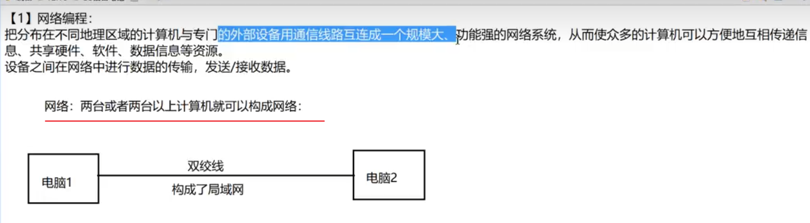
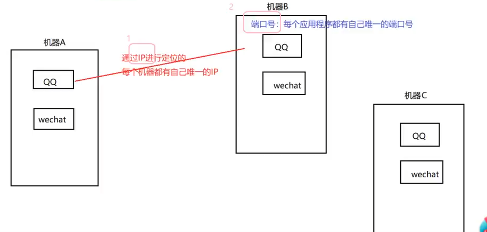
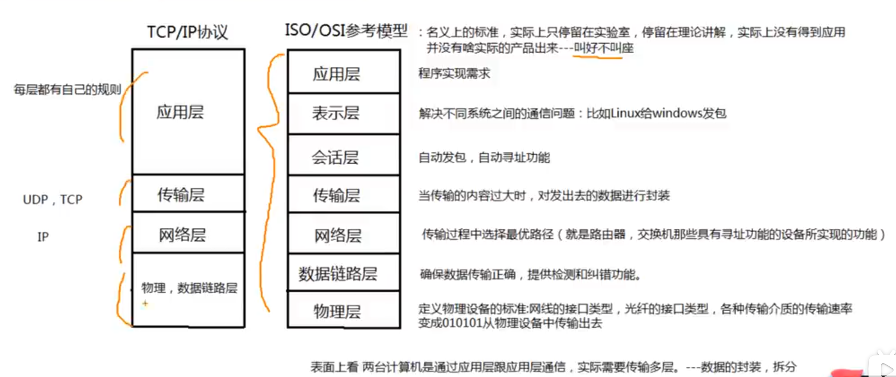
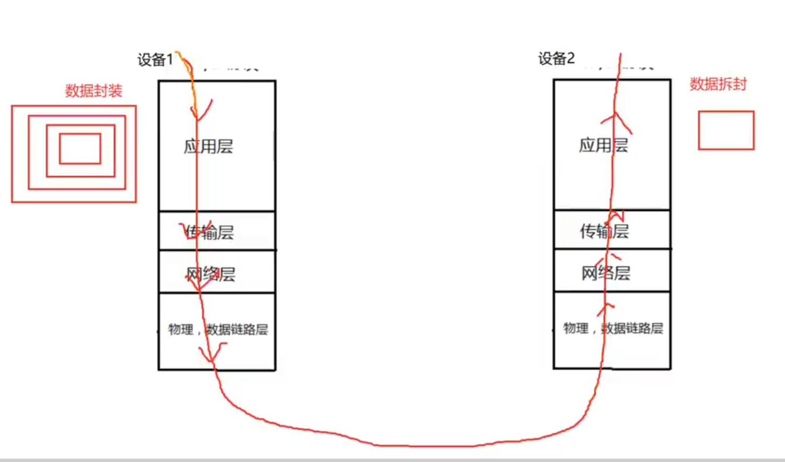
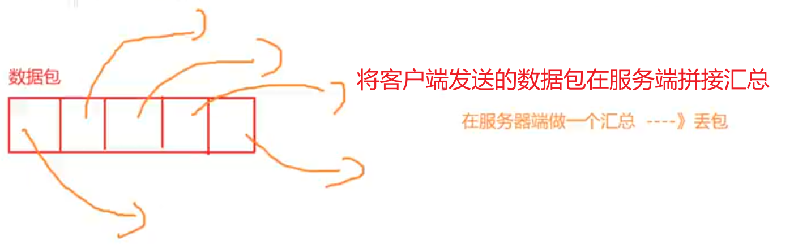

#### 网络编程

1. 网络

2. 网络通信: 两个重要的要素 -- IP + Port（端口号）

3. 设备之间进行传输的时候，必须遵照一定的规则 ---> 通信协议：

1. TCP协议：三次握手，四次分手（可靠的）
    1. 三次握手： 1.客户端发送请求。 2.客户端接收到请求并返回相应。3.客户端收到响应并向服务端发送接口到响应的回复请求
    2. 四次分手：1.客户端发送想要断开连接的请求。2.服务端接收到请求并返回相应。3.服务端向客户端发送断开连接的消息。4.客户端向服务端发送请求，看是否真正断开。
2. UDP协议：不可靠，可能会丢包

​	