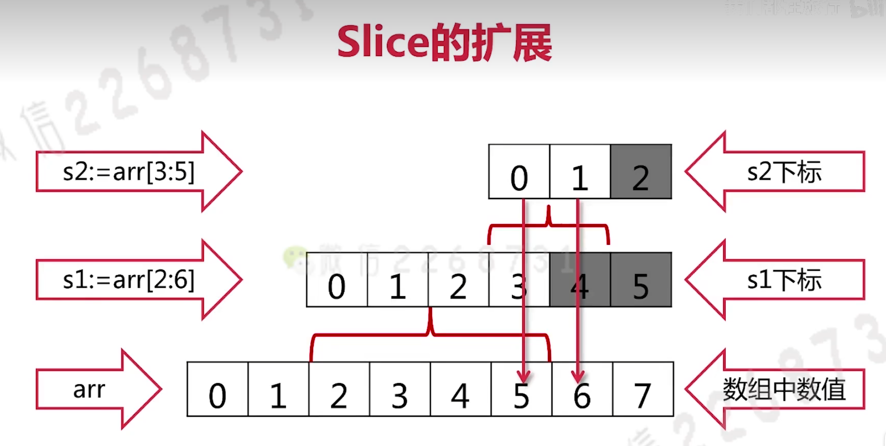
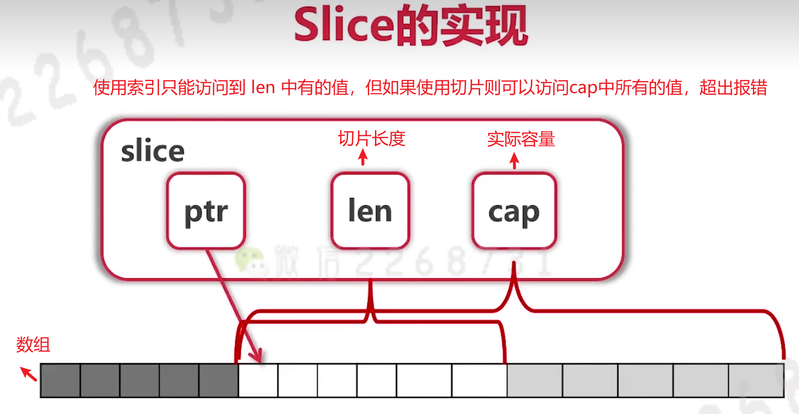

#### 切片的补充

1. 切片是引用类型，切片相当于数组的一个view



```go
package main

import "fmt"

// 指针
func main() {
	intArr := [...]int{0, 1, 2, 3, 4, 5, 6, 7}

	s1 := intArr[2:6]
	s2 := s1[3:5]
	// 如果s2切片后剩余的索引，它还是会报错
	// s2 := s1[3: 8]
	// 由此可发现，此这个指向同一个内存地址
	fmt.Println(&intArr[5])
	fmt.Println(&s1[3])
	fmt.Println(&s2[0])

	fmt.Printf("s1的值为%v, len(s1)为：%d，cap(s1)为：%d\n", s1, len(s1), cap(s1))
	fmt.Printf("s2的值为%v, len(s2)为：%d，cap(s2)为：%d\n", s2, len(s2), cap(s2))

}


```


#### slice实现



// 有上图可知，slice是可以`向后扩展`的，但slice`不能向前扩展`。(详情看上述代码)


##### 向Slice添加元素

添加元素时，如果超越cap，系统会拷贝原数组然后重新分配更大的底层数组（新的数组）。

```go
package main

import "fmt"

// 指针
func main() {
	intArr := [...]int{0, 1, 2, 3, 4, 5, 6, 7}

	s1 := intArr[2:6]
	s2 := s1[3:5]
	// s3由于cap(s2)还有一个7的位置，所以直接覆盖了
	s3 := append(s2, 10)
	// s4与s5都超出了cap，所以系统将原数组拷贝后重新生成一个新数组
	s4 := append(s3, 11)
	s5 := append(s4, 12)

	fmt.Println("s3, s4, s5 =", s3, s4, s5)
	fmt.Println("intArr=", intArr)

}

```

