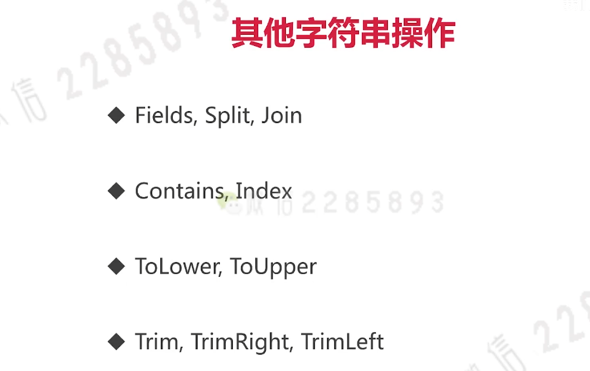

#### rune - 相当于go的char(几乎等于int32)

1. rune是为了解决中文等字符不是一个字节(中文一般占3个字节)导致的问题。

```go
package main

import (
	"fmt"
	"unicode/utf8"
)

func main() {
	str := "hello,我是北极熊。" // utf-8编码
	// %s 以字符串形式显示
	fmt.Printf("%s \n", str)
	// %X 可以将具体字节打印出来
	// 首先将str转化为字节切片，然后遍历此字节切片
	for _, b := range []byte(str) {
		fmt.Printf("%X ", b)
	}
	fmt.Println()

	// 遍历此字符串打印
	for i, ch := range str { // ch is a rune(int32)
		fmt.Printf("(%d %c) ", i, ch)
	}
	fmt.Println()

	// 将str转化为字节（rune）切片遍历
	for i, ch := range []rune(str) {
		fmt.Printf("(%d %c)", i, ch)
	}
	fmt.Println()

	// 使用utf8库帮助理解rune
	// utf8.RuneCountInString(str)获取真正的字符数量，而不是字节数量
	// len()如果有中文之类的获取到的就是字节长度
	fmt.Println("rune count:", utf8.RuneCountInString(str))
}

```

其他字符串操作，都在一个strings内置包内

